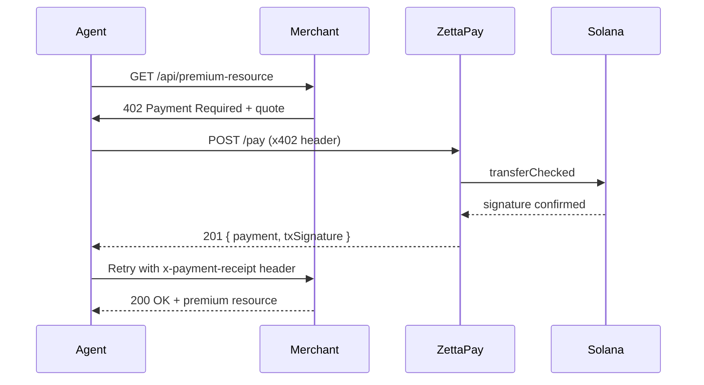

The agentic AI economy has a payments problem: traditional card
processors charge 2.9% on every micro-transaction, custody of a private
key by an autonomous agent is catastrophic, and there is no widely
adopted protocol for agent → merchant settlement.

ZettaPay solves this with two open standards:

- **[x402](/guides/x402-protocol)** — an HTTP header that carries a
  signed Solana transaction blob. An agent pays by attaching the blob
  to a request; ZettaPay submits it on the agent's behalf.
- **[MCP](/guides/mcp-integration)** — Model Context Protocol tools
  that expose `pay`, `get_merchant`, `list_payments` and
  `create_onramp_url` over JSON-RPC, so any MCP-aware agent (Claude,
  ChatGPT operators, custom runtimes) can transact without custom code.

## Why this works

<CardGroup cols={2}>
  <Card title="No custody risk" icon="key">
    The agent receives a partially-signed transaction from the merchant
    backend, attaches its own signature inside an x402 header, and
    submits. The agent's signing key is scoped to a single transaction.
  </Card>
  <Card title="Sub-cent fees" icon="bolt">
    Solana transaction fees are well under one cent. ZettaPay's protocol
    fee is 0.30%. Combined cost is an order of magnitude below legacy
    card rails — agent micro-payments become viable.
  </Card>
  <Card title="Sub-second settlement" icon="clock">
    Payments confirm in roughly one to two seconds. An agent never has
    to wait days for a clearance window.
  </Card>
  <Card title="Open spec" icon="code">
    x402 is an open header spec. Any merchant — even one not using
    ZettaPay — can adopt it without licensing.
  </Card>
</CardGroup>

## Reference flow

## Build an agent integration

<Card title="x402 protocol guide" icon="arrow-right" href="/guides/x402-protocol">
  Full request format, signature rules and error codes for agent payments.
</Card>

<Card title="MCP integration guide" icon="arrow-right" href="/guides/mcp-integration">
  Wire ZettaPay into Claude Desktop, ChatGPT operators, or any
  MCP-aware runtime in under ten lines of JSON.
</Card>

<Card title="Native AI integrations" icon="arrow-right" href="/concepts/native-integrations">
  Drop-in recipes for Anthropic Claude, OpenAI, and Hugging Face
  agent runtimes.
</Card>
